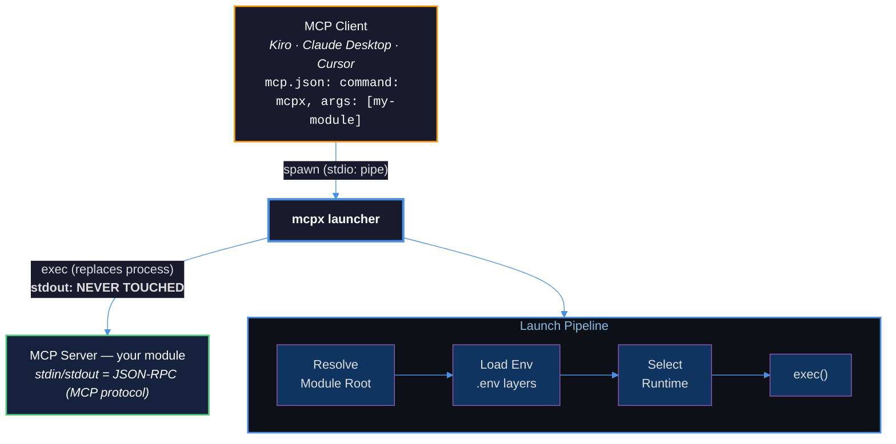

<h1 align="center" style="font-weight:500"><strong>Universal MCP Module Launcher</strong></h1>
<p align="center">One command to run any MCP server module — in any language, on any platform. A manifest-driven launcher for <a href="https://stdiobus.com" target="_blank">stdio Bus</a> ecosystem that replaces hardcoded bash commands in <code>mcp.json</code> with a portable, runtime-agnostic <code>mcpx run &lt;module&gt;</code>.
</p>

<p align="center">
<a href="https://www.npmjs.com/package/@stdiobus/mcpx"></a>
<a href="https://modelcontextprotocol.io"></a>
<a href="https://agentclientprotocol.com"></a>
<a href="https://github.com/stdiobus"></a>
<a href="https://nodejs.org"></a>
<a href="https://www.typescriptlang.org"></a>
<a href="https://github.com/stdiobus/mcpx"></a>
<a href="https://github.com/stdiobus/mcpx"></a>
<a href="https://github.com/stdiobus/mcpx"></a>
<a href="LICENSE"></a>
<a href="https://github.com/stdiobus/mcpx/actions/workflows/ci.yml"></a>
<a href="https://github.com/stdiobus/mcpx"></a>
</p>

## Why mcpx?

MCP client configurations (`mcp.json`) are full of hardcoded bash commands, fragile paths, and duplicated environment setup. When a module moves, changes runtime, or needs new env vars, every client config breaks.

mcpx replaces all of that with a single portable command. Define your module once in `module.json`, and any MCP client can launch it with `mcpx run <module-id>`.

## How It Works



## Quick Start

mcpx discovers modules inside a **Module Root** (`~/.ai/` by default, override with `MCPX_ROOT`).  
Each module is a folder under `modules/` with a `module.json` manifest and an entry file.

```
~/.ai/                        ← Module Root
└── modules/
    └── my-module/            ← one module = one directory
        ├── module.json       ← manifest: id, runtime, entry
        └── server.ts         ← your MCP server code
```

### Minimal working example

```bash
# 1. Install mcpx
npm install -g @stdiobus/mcpx

# 2. Create module directory
mkdir -p ~/.ai/modules/my-module

# 3. Create manifest
cat > ~/.ai/modules/my-module/module.json << 'EOF'
{
  "id": "my-module",
  "name": "My MCP Server",
  "runtime": "nodejs",
  "entry": "server.ts"
}
EOF

# 4. Create entry file
cat > ~/.ai/modules/my-module/server.ts << 'EOF'
// your MCP server code here
EOF

# 5. Run
mcpx run my-module
```

> Use `MCPX_ROOT=/your/path mcpx run my-module` to point at a different root.

## Features

- **Language-agnostic** — supports Node.js, Python, Go, Rust, Shell, and Docker
- **Stdio-transparent** — uses `exec` to replace the process; zero buffering, zero corruption
- **Manifest-driven** — one `module.json` describes everything: runtime, entry, env, args
- **Env management** — layered `.env` loading with precedence rules, secret masking, template expressions
- **Cross-platform** — macOS, Linux, and Windows (Node.js 18+)
- **MCP-native** — drop-in replacement for hardcoded commands in any `mcp.json`

## Usage

### `mcpx run <module>`

Launch a module by ID. This is the default command — `mcpx my-module` is equivalent to `mcpx run my-module`.

```bash
mcpx run my-module
mcpx run my-module -- --port 3000    # pass extra args
MCPX_ROOT=/path/to/modules mcpx run my-module
```

### `mcpx list`

Show all discovered modules with their status.

```bash
mcpx list
mcpx list --json
```

Output:
```
  my-module         My MCP Server        nodejs   ready
  python-tools      Python Tools         python   ready
  broken-mod        Broken Module        go       unavailable
```

### `mcpx doctor`

Validate manifests, check runtime availability, verify env resolution.

```bash
mcpx doctor
mcpx doctor --json
```

### `mcpx env <module>`

Display resolved environment variables for a module (values masked).

```bash
mcpx env my-module
```

Output:
```
  OPENAI_API_KEY    sk-p****
  DATABASE_URL      post****
```

## module.json Reference

```jsonc
{
  // Required
  "id": "my-module",           // 1–128 chars, lowercase alphanumeric + hyphens
  "name": "My MCP Server",    // 1–256 chars, human-readable
  "runtime": "nodejs",         // nodejs | python | go | rust | shell | docker
  "entry": "src/server.ts",   // relative path from module directory

  // Optional
  "version": "1.0.0",         // semver (MAJOR.MINOR.PATCH)
  "description": "A helpful MCP server",  // max 1024 chars
  "env": {                     // max 64 entries
    "API_KEY": "",             // empty = required, no default
    "PORT": "3000"             // non-empty = default value
  },
  "args": ["--verbose"]        // max 64 elements, passed to process
}
```

### Complete Example

```json
{
  "id": "code-assistant",
  "name": "Code Assistant MCP Server",
  "runtime": "nodejs",
  "entry": "dist/index.js",
  "version": "2.1.0",
  "description": "AI-powered code analysis and generation",
  "env": {
    "OPENAI_API_KEY": "",
    "MODEL": "gpt-4o",
    "MAX_TOKENS": "4096"
  },
  "args": ["--stdio"]
}
```

## Supported Runtimes

| Runtime  | Entry Extensions   | Tool Required       | Exec Command                          |
|----------|--------------------|---------------------|---------------------------------------|
| nodejs   | `.ts`              | `npx`, `node`       | `npx tsx <entry>`                     |
| nodejs   | `.js`, `.mjs`      | `node`              | `node <entry>`                        |
| python   | `.py`              | `uv` or `python3`   | `uv run <entry>` or `python3 <entry>` |
| go       | `.go` or binary    | `go`                | `go run <entry>` or `./<binary>`      |
| rust     | (cargo project)    | `cargo`             | `cargo run` or `./target/release/<id>`|
| shell    | `.sh`              | `/bin/sh`           | `/bin/sh <entry>`                     |
| docker   | (image name)       | `docker`            | `docker run --rm -i <entry>`          |

## Environment Variables

### Precedence (highest wins)

1. **System environment** — variables already set in the process (from MCP client `env` field)
2. **Module `.env`** — `{module_dir}/.env`
3. **Root `.env`** — `{MCPX_ROOT}/.env`
4. **Manifest defaults** — `module.json` `env` field values

### .env Format

```bash
# Comments start with #
API_KEY=sk-your-key-here
DATABASE_URL="postgres://localhost/mydb"
EMPTY_VAR=
```

### mcpx Environment Variables

| Variable      | Description                                      |
|---------------|--------------------------------------------------|
| `MCPX_ROOT`   | Override module root directory                   |
| `MCPX_DEBUG`  | Set to `1` to enable verbose diagnostic output  |
| `MCPX_ARGS`   | Additional arguments (POSIX shell quoting rules) |

### Env Template Expressions (v2)

```json
{
  "env": {
    "API_KEY": "$env:OPENAI_API_KEY",
    "CERT": "$file:/etc/ssl/cert.pem",
    "TOKEN": "$cmd:aws secretsmanager get-secret-value --secret-id my-token"
  }
}
```

- `$env:VAR` — read from environment variable
- `$file:path` — read file contents
- `$cmd:command` — execute command (10s timeout)

## MCP Client Integration

### Kiro

```json
{
  "mcpServers": {
    "my-module": {
      "command": "mcpx",
      "args": ["my-module"],
      "env": {
        "MCPX_ROOT": "/path/to/modules"
      }
    }
  }
}
```

### Claude Desktop

```json
{
  "mcpServers": {
    "my-module": {
      "command": "mcpx",
      "args": ["run", "my-module"],
      "env": {
        "API_KEY": "sk-your-key"
      }
    }
  }
}
```

### Cursor

```json
{
  "mcpServers": {
    "my-module": {
      "command": "mcpx",
      "args": ["my-module", "--", "--port", "3000"]
    }
  }
}
```

## Exit Codes

| Code | Meaning                                              |
|------|------------------------------------------------------|
| 0    | Success (module exited normally)                     |
| 1    | General error (module not found, unknown error)      |
| 2    | Manifest error (invalid JSON, missing required field)|
| 3    | Runtime error (tool not installed, exec failed)      |
| 4    | Environment error (required variable missing)        |

## Registry Commands (v3)

```bash
mcpx install <module-name>    # Install from registry
mcpx publish                  # Publish current module
mcpx upgrade [module-id]      # Upgrade installed modules
mcpx search <query>           # Search the registry
```

## Contributing

Contributions are welcome. Please open an issue first to discuss what you'd like to change.

```bash
git clone https://github.com/stdiobus/mcpx.git
cd mcpx
yarn install
yarn run build
yarn test
```

## License

[Apache-2.0](https://www.apache.org/licenses/LICENSE-2.0)
